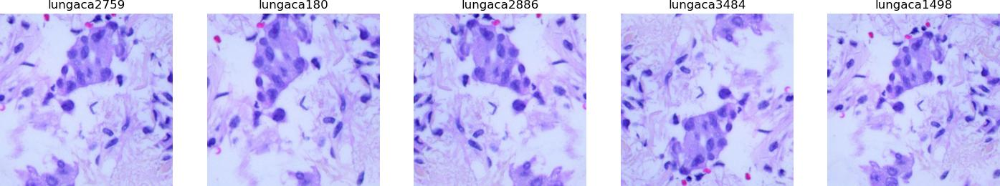

# LC25000-clean histopathology benchmark

## Evaluating Histopathology Foundation Models for Few-shot Tissue Clustering: an Application to LC25000 Augmented Dataset Cleaning
*Accepted to: MICCAI 2024, 2nd Workshop on Data Engineering in Medical Imaging (DEMI)*

Paper Link | [Open Access (from October 2025)](https://ora.ox.ac.uk/objects/uuid:df7ad16b-f130-4f16-8f7f-aab5de53f111) | [Code](https://github.com/GeorgeBatch/LC25000-clean) | [Cite](#cite)

**Abstract:** Recent digital histopathology datasets have significantly advanced the development of deep learning-based histopathology frameworks. 
However, data leakage in model training can lead to artificially high metrics that do not genuinely reflect the strength of the approach.
The LC25000 dataset, consisting of tissue image tiles extracted from lung and colon samples, is a popular benchmark dataset. 
In the released version, tissue tiles were augmented randomly and mixed.
Nevertheless, many studies report near-perfect accuracy scores, often due to data leakage, where augmented images of the same tissue tile are split into both training and test sets.
To improve the quality of performance reports, we develop a semi-automatic pipeline to clean LC25000. 
By clustering and separating all augmented images of the same tiles, using recently proposed histopathology foundation models and manual correction, we create a clean version of LC25000.
We then evaluate the quality of features extracted by these foundational models, using the clustering task as a benchmark.
Our contributions are: 
1) We publicly release our semi-automatic annotation pipeline along with the LC25000-clean dataset to facilitate appropriate utilization of this dataset, reducing the risk of overestimating models' performance; 
2) We profile various combinations of feature extraction and clustering methods for identifying duplicates of the same image generated by basic image transformations; 
3) We propose the clustering task as a minimal-setup benchmark to evaluate the quality of tissue image features learned by histopathology foundation models.

## What is inside this repository?

The LC25000 Dataset is a widely used histology image dataset. The samples in the dataset contain highly correlated images, thus resulting in data leakage if models are both trained and evaluated on it. This repository contains (1) the cleaned dataset with highly correlated images grouped together, (2) the code for the semi-automatic cleaning pipeline, (3) the evaluation code for using the cleaned dataset as a minimal setup benchmark for new histopathology foundation models.

## About LC25000 Dataset

The LC25000 dataset is a large-scale dataset for histology image classification. It contains 25000 images (patches extracted from WSI images) with 5000 images per class.
The dataset can be downloaded by following the instructions from the official GitHub repository: https://github.com/tampapath/lung_colon_image_set/

**Dataset Paper:** Borkowski AA, Bui MM, Thomas LB, Wilson CP, DeLand LA, Mastorides SM. Lung and Colon Cancer Histopathological Image Dataset (LC25000). [arXiv:1912.12142v1 [eess.IV], 2019](https://arxiv.org/abs/1912.12142v1)

The paper provides the following information about the dataset:

_"HIPAA compliant and validated seven hundred fifty total images of
lung tissue (250 benign lung tissue, 250 lung adenocarcinomas, and
250 lung squamous cell carcinomas) and 500 total images of colon
tissue (250 benign colon tissue and 250 colon adenocarcinomas)
were captured from pathology glass slides as we previously
described.[[8]](https://www.ncbi.nlm.nih.gov/pmc/articles/PMC6837334/) ... Using Augmentor, we expanded our dataset to 25,000 images by the
following augmentations: left and right rotations (up to 25 degrees,
1.0 probability) and by horizontal and vertical flips (0.5
probability)."_

## Motivation

The LC25000 dataset is a popular resource with more than 140 works citing the it [(142 according to Semantic Scholar on June 28th, 2024)](https://www.semanticscholar.org/paper/Lung-and-Colon-Cancer-Histopathological-Image-Borkowski-Bui/6c5a72aaa3c29d52d46ef904f15719478b6cdfc2).

Each of the 5 classes contains 5000 images generated by doing rotations and flips from the 250 original images resulting on average in 20 highly-correlated samples. If the dataset is randomly split into train+validation and test sets using the 80/20 ratio, we can expect 99% $^\star$ of the images to have a highly correlated image in both the training+validation and the test sets. This leads to overestimation of the model's performance.

$^\star$ For a demonstration of the expected extent of data leakage see notebook [0-expected-data-leakage-calculation.ipynb](./0-expected-data-leakage-calculation.ipynb).



## Data

LC25000 dataset can be downloaded by following the instructions from the official GitHub repository (https://github.com/tampapath/lung_colon_image_set/) or from HuggingFace (https://huggingface.co/datasets/1aurent/LC25000).

The data directory should have the following structure:

```
LC25000-clean (this repository)
    README.md
    annotations/
    ...
    LC25000/
        lung_aca/
            lungaca1.jpg
            lungaca2.jpg
            ...
        lung_n/
            lungn1.jpg
            lungn2.jpg
            ...
        lung_scc/
            lungscc1.jpg
            lungscc2.jpg
            ...
        colon_aca/
            colonaca1.jpg
            colonaca2.jpg
            ...
        colon_n/
            colonn1.jpg
            colonn2.jpg
            ...
```

## Environment Setup

Run the commands detailed in the [environment-creation.md](./environment-creation.md) file to create a conda environment with the necessary dependencies.

## 1. Feature Extraction

Used a pre-traned UNI model to extract features from each of the classes of the LC25000 dataset (5000 images per class). The features are then saved in a `features.npy` file. The mapping of the image index in the `.npy` file to the image path was also saved in `ids_2_img_paths.json`.

**UNI paper:** Chen, R.J., Ding, T., Lu, M.Y., Williamson, D.F.K., et al. Towards a general-purpose foundation model for computational pathology. Nat Med (2024). https://doi.org/10.1038/s41591-024-02857-3

**Notebook:** [1-feature-extraction.ipynb](./1-feature-extraction.ipynb)
**Script**: [extract_features.py](extract_features.py)

```shell
python extract_features.py \
    --cancer_type lung_aca \
    --img_norm resize_only \
    --extractor_name UNI \
    --device cuda \
    --batch_size 256
```

Notes:
* If file exists, the user will be asked whether to overwrite it.
* The script will also print the progress of the feature extraction.

## 2. Clustering and Manual Annotation

Used scikit-learn KMeans clustering to cluster the features extracted from the UNI model. The number of clusters was set to 250. The clustering was done on the features extracted from the LC25000 dataset.

After the clustering, pick the image closest to the cluster centroid to be the representative image of the cluster. The other samples in the cluster were compared manually to the representative image. If the samples were similar to the representative image, they were kept in the cluster. If they were not similar, they were recorded as not belonging to the cluster.

**Notebook:** [2-clustering-interactive.ipynb](./2-clustering-interactive.ipynb)

## 3. Evaluation of the Features

The features was evaluated by using the manual annotations as the ground truth. The features were evaluated using the following metrics:

* Retrieval metrics to evaluate if the closest images in the feature space are from the same original image
    - precision@1
    - precision@5

* Binary connectivety metrics: two images are considered connected (label 1) if they are in the same ground truth cluster, and disconnected (label 0) otherwise.
    - Confusion Matrix
    - Accuracy
    - Precision
    - Recall
    - F1 Score
    - Specificity
    - Balanced Accuracy

* Clustering metrics: to evaluate the quality of the clustering against the manual clustering
    - Fowlkes-Mallows Index
    - Adjusted Rand Index (ARI)
    - Normalized Mutual Information (NMI)
    - Homogeneity
    - Completeness
    - V-Measure

**Notebook:** [3-evaluation.ipynb](./3-evaluation.ipynb)
**Script**: [evaluate_clustering.py](evaluate_clustering.py)

```shell
python evaluate_clustering.py \
  --cancer_type lung_aca \
  --img_norm resize_only \
  --extractor_name UNI \
  --distance_metric euclidean \
  --dimensionality_reduction PCA-0.95 \
  --clustering kmeans
``` 

Except for the `cancer_type`, all other arguments can also be set to `all` to evaluate all computed features with all implemented distance metrics, dimensionality reduction techniques, and clustering algorithms.

Other arguments:
- `--manual_annotations_dir`: Directory containing the manual annotations
- `--overwrite`: Overwrite the existing evaluation results
- `--verbose`: Print the evaluation metrics


## 4. Analysis of the Evaluation Results

To reproduce plots from the paper, run the notebook [4-analyze-clustering-results.ipynb](./4-analyze-clustering-results.ipynb).

## 5. Classification Experiments

The cleaned dataset was used to understand how much the performance was affected by the dataset contamination. Set-up:
* 2 dataset versions: original and cleaned (used for train/test splitting in random or grouped manner respectively)
* 3 train/test split ratios: 80/20, 20/80, and 5/95
* 10 random splits of each dataset to get mean and standard deviation classification accuracy
* 3 feature extractors: UNI, Phikon, and ResNet18
* 2 classifiers: KNN and Linear

**Notebook:** [5-one-shot-and-linear-probing.ipynb](./5-one-shot-and-linear-probing.ipynb.ipynb)

## Evaluating a New Model

To evaluate a new model on the cleaned dataset, follow these steps:

0. Download the data and set up the environment as described in the previous sections.
1. Prepare the model in the same format as the other models in [source/feature_extraction/get_model_with_transform.py](./source/feature_extraction/get_model_with_transform.py). The model should inherit from `torch.nn.Module` and have a `forward` method that takes an image tensor and returns a feature tensor. If the model is set-up in a different way, adjust it like shown in [source/feature_extraction/models/owkin_phikon.py](./source/feature_extraction/models/owkin_phikon.py).
2. Extract features from the model using the `extract_features.py` script using your preferred normalization method.
3. Evaluate the features using the `evaluate_clustering.py` script. You can add other dimensionality reduction techniques and clustering algorithms to the script if needed by modifying `reduce_feature_dimensionality()` and `get_clustering_labels()` in [source/eval_utils.py](./source/eval_utils.py)
4. Analyze the evaluation results using the [4-analyze-clustering-results.ipynb](./4-analyze-clustering-results.ipynb) notebook.
5. Run classification experiments using the [5-one-shot-and-linear-probing.ipynb](./5-one-shot-and-linear-probing.ipynb) notebook.

## Acknowledgements

George Batchkala is supported by Fergus Gleeson's A2 research funds, UKRI DART Lung Health Program (Innovate UK grant 40255), and the EPSRC Center for Doctoral Training in Health Data Science (EP/S02428X/1).

This project relied on other repositories.
1. feature extraction: [UNI](https://github.com/mahmoodlab/UNI/), [Prov-GigaPath](https://github.com/prov-gigapath/prov-gigapath), [Phikon](https://github.com/owkin/HistoSSLscaling/), [DINOv2](https://github.com/facebookresearch/dinov2), [dsmil-wsi](https://github.com/binli123/dsmil-wsi)
2. dimensionality reduction and clustering: [scikit-learn](https://github.com/scikit-learn/scikit-learn)

## Cite

Pre-publication citation. Will be updated after the workshop date (10th of October 2024).

```
@inproceedings{batchkala2024lc25000-clean,
  title = {Evaluating histopathology foundation models for few-shot tissue clustering: an application to LC25000 augmented dataset cleaning},
  author = {Batchkala, G and Li, B and Rittscher, J},
  editor = {Bhattarai, B and Ali, S and Rau, A and Caramalau, R and Nguyen, A and Gyawali, P and Namburete, A and Stoyanov, D},
  year = {2024},
  organizer = {2nd International Workshop on Data Engineering in Medical Imaging (DEMI 2024) at MICCAI 2024},
  publisher = {Springer Nature Switzerland},
}
```
